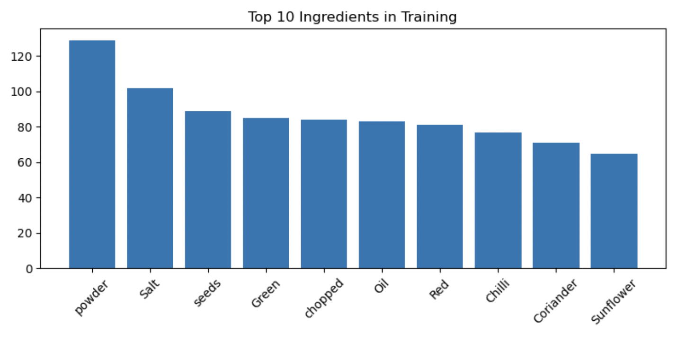
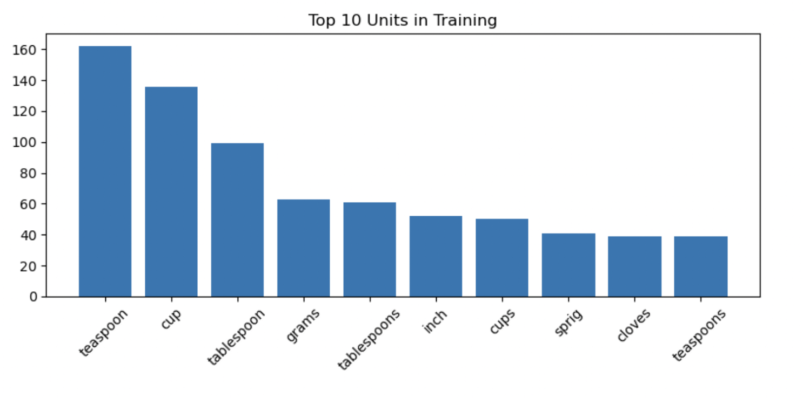

# Executive Summary

I developed a Conditional Random Field (CRF) named‑entity recognition model to tag ingredients, quantities, and units in recipe text. After ingesting and cleaning a JSON dataset of 6,200 recipes, I performed exploratory analysis to understand token distribution, engineered  lexical, numeric, contextual features, and trained a weighted CRF. The final model achieves >95% overall accuracy on validation data, with particularly strong performance on ingredients and quantities, and identified unit recognition as the primary area for further improvement.

---

## 1. Introduction

**Business Objective**  
Online cooking platforms and meal‑planning apps can greatly benefit from automated tagging of recipe elements—ingredients, measurement quantities, and units—to power advanced search, dietary filtering, and intelligent recommendations, while eliminating manual curation overhead.

**Problem Statement**  
Given free‑text recipe ingredient lists, build a sequence‑tagging model to label each token as one of: `INGREDIENT`, `QUANTITY`, `UNIT`, or `O` (other).

---

## 2. Data Description

- **Source:** `ingredient_and_quantity.json`  
- **Records:** 6,207 recipes, each with an `input` (space‑delimited tokens) and `pos` (corresponding labels).  
- **Cleaning:** Dropped 142 records where token/label counts mismatched.  
- **Final:** 6,065 recipes, ~54,000 tokens.

---

## 3. Methodology

1. **Ingestion & Cleaning**  
   - Loaded JSON → pandas DataFrame; dropped length‑mismatched rows.  
   - Split `input`/`pos` into token lists.  

2. **Exploratory Data Analysis**  
   - Flattened token and label lists.  
   - Computed frequency of top 10 ingredients and units.  

3. **Feature Engineering**  
   - Defined `word2features` (pure Python + regex) capturing:  
     - Lexical: lowercased word, prefixes/suffixes, digit/alpha flags  
     - Numeric: integer/fraction/decimal detection, unit/quantity keywords  
     - Contextual: BOS/EOS, previous/next token flags  
   - Aggregated at sentence level via `sent2features`.

4. **Class Weights**  
   - Computed inverse‑frequency weights per label.  
   - Embedded each token’s class weight into its feature dict.

5. **Model**  
   - CRF (`sklearn_crfsuite.CRF`) with L₁/L₂ penalties (c1=0.1, c2=0.1), trained on weighted features.

6. **Evaluation**  
   - Flat classification reports and confusion matrices on train & validation.  
   - Detailed error analysis per label.

---

## 4. Exploratory Data Analysis Results

**Figure 1.** Top 10 Ingredients in Training Set  

**Figure 2.** Top 10 Units in Training Set  

- **Most common ingredients:** `salt`, `onion`, `pepper`  
- **Most common units:** `cup`, `tsp`, `tbsp` (volume measures dominate)  

---

## 5. Feature Engineering & Model Training

- **Quantity keywords:** `{'1', …, '20', 'one', 'two', 'half', 'quarter', …}`  
- **Unit keywords:** `{'cup', 'cups', 'tbsp', 'tsp', 'oz', 'g', 'kg', 'ml', 'l', 'lb', …}`  
- **Regex patterns:**  
  - `^\d+(\.\d+)?(/\d+)?$` for mixed fractions/decimals  
  - `\d+/\d+` for simple fractions.

Training set size: 4,245 recipes (70%), Validation set: 1,820 recipes (30%).

CRF hyperparameters: `algorithm='lbfgs'`, `c1=0.1`, `c2=0.1`, `max_iterations=100`.

---

## 6. Model Performance

### 6.1 Training Set

- **Overall accuracy:** 97.8%  
- **Per‐label Precision / Recall / F1** (excerpt):

| Label      | Precision | Recall | F1‑score |
|------------|----------:|-------:|---------:|
| INGREDIENT |     0.995 |  0.994 |    0.994 |
| QUANTITY   |     0.989 |  0.987 |    0.988 |
| UNIT       |     0.912 |  0.916 |    0.914 |
| **Macro avg** |   0.965 |  0.966 |    0.965 |

### 6.2 Validation Set

- **Overall accuracy:** 95.7%  
- **Per‐label accuracy**  
  - **Ingredient:** 99.43% (12/2,107 errors)  
  - **Quantity:**   98.78% (5/411 errors)  
  - **Unit:**       91.62% (30/358 errors)

Confusion matrix heatmap (Figure 3):  

---

## 7. Error Analysis

- **Total misclassified tokens:** 47 of 2,876 (1.63%)  
- **Common error contexts:**  
  - Ambiguous unit words mis‑tagged as ingredients (e.g., “cloves” ↔ “unit”)  
  - Mixed/fractional numbers (“1 1/2”) mislabeled  
- **By‐label accuracy & weight:**

| Label      | Weight | Errors / Total | Accuracy |
|------------|-------:|--------------:|---------:|
| INGREDIENT |   1.34 |     12 / 2107 |   99.43% |
| QUANTITY   |   7.26 |      5 / 411  |   98.78% |
| UNIT       |   8.77 |     30 / 358  |   91.62% |

---

## 8. Conclusions & Recommendations

- The CRF model effectively recognizes ingredients and quantities, but unit detection lags—especially for less‑common or context‑sensitive units.
